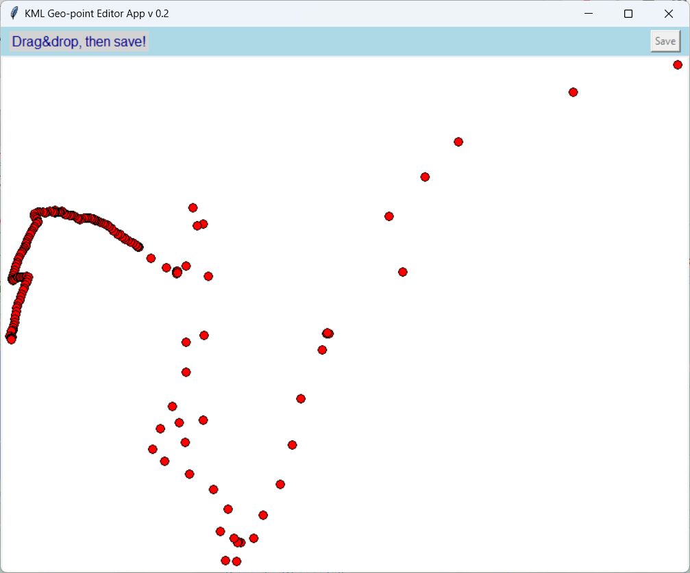
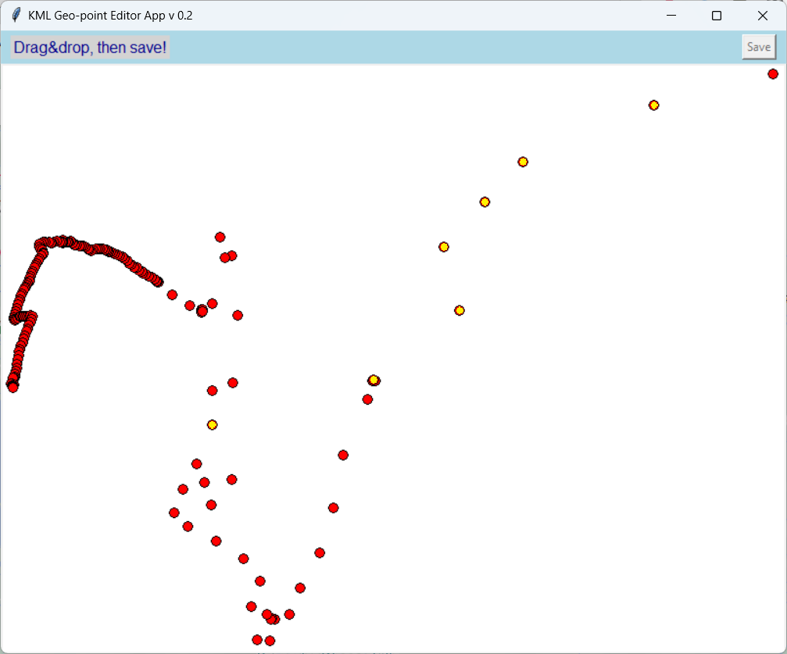
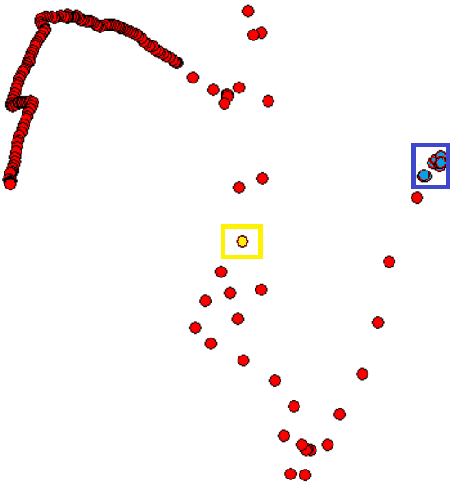
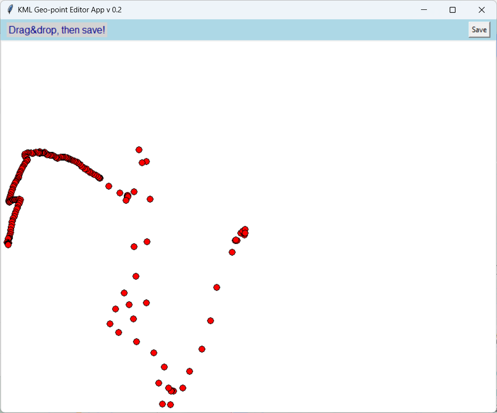
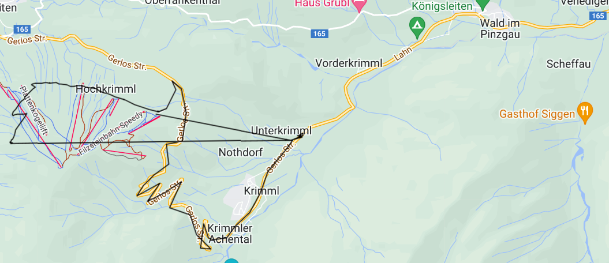

# KMLeditor 

##Graphical (Google) KML file editor
version 0.2 - editing Google map path coordinates (without map background)

**Read (Google maps) KML file:** The read_kml_file() function reads the selected KML file and extracts the KML geo-data from it.

It removes the first XML declaration if exists before further processing by fastkml module.

**Extracting coordinates:** The function extract_coordinates() extracts the coordinates from the KML file.

**Calculation of the bounding box:** The calculate_bounding_box() function calculates the smallest (geo-coordinate based) bounding box for the given coordinates.

**Displaying coordinates:** The software displays the coordinates on a 2D canvas (software window), where individual points can be moved interactively.

If any change occurs in the coordinates, the modified path can be saved as a basic (Google map compatible) kml file. Supplementary informations may be lost, modified path is suggested to be saved as a copy!

This code allows you to graphically display the coordinates of Google Maps KMZ files and move points interactively. If you need additional functions, the code can be further developed.

##Functionality Test&Samples:
- src folder contains the Python3 code to run

 - test subfolder contains:
 
 **a) history-2024-08_original.kml**, a Google KML file containing 2 paths (one driving and one walking), that can be loaded and modified. Original and modified path lines are demonstrated as images, see the info folder section.
 
 **b) history-2024-08_modified.kml** a modified version of the above mentioned file, in a simple Google Maps compatible format

Both kml files can be imported in the Google Own Map services, when a new map is created and a new layer is added to the map, then the Import option show up and can be used for data import.
 
- info folder contains:

 **a) before_modification.png** and **original_path_Gmap.png**, which show the software window with the registered path points and the same path on the map, respectively,

 **b) modified_points.png** highlighted in yellow those locations which have been modified (by Drag&Drop) and **modification_groups.png** showing the points that are moved from their original location,

 **c) after_modification.png** and **modified_path_Gmap.png**, which show the software window with the original path points besides the modified points and the same modified path on the (Google My Maps) map, respectively.

##Notes: 
    Google map path contains multiple points as parts of a **Linestring** which defines a set of geo-coordinates which should be connected (on the map by a line) in the order of appearence.
	[Google PolyLines, examples](https://developers.google.com/maps/documentation/javascript/examples/polyline-simple)
	
    Google map is not loaded to serve as background as it requires Google API key. Not part of this basic software!

##Prerequisites:
in command line prompt, install the following modules by typing:
pip install fastkml tkinter shapely

Check existance of pygeoif module in Python IDLE (or IDE) by an import test:
from pygeoif import Point, LineString

Modified path saved to Google Maps compatible KML format:

'''xml
<?xml version="1.0" encoding="UTF-8"?>
<kml xmlns="http://www.opengis.net/kml/2.2">
<Document>
  <Placemark> 
    <LineString>  
      <coordinates>17.2012735,47.8064775,0 </coordinates>
    </LineString>  
  </Placemark>  
</Document>  
</kml>
'''

## Possible developments
- removing points would be a key point and easy-to-make option,

- in contrast adding track points is a bit more tricky because the points should be added at the right place in the order of points (LineString) to avoid dizzy lines,

- highlighting a point by clicking is an easy request but I consider it does not add much to the track modification functionality, rather it serves fanciness only,

- adding real maps (with continuous updates) in the background would be the best development as a positive outcome but has a high coding time demand, but either the software should use a common Google API key that due to economical reasons Google does not offer, or each user should use their own API key which I consider to be an overcomplication of the task and functionality.

**@author: Data4every1**
Created on Mon Aug 10 14:12:27 2024